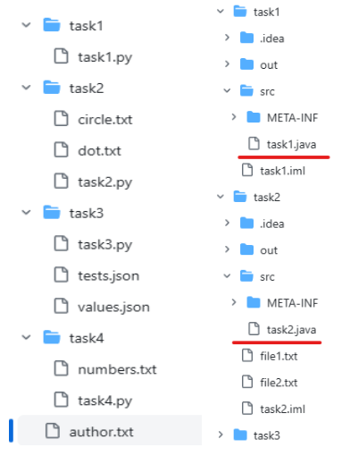

# Задание НТ Performance Lab

## Порядок выполнения и сдачи

    Все задания выполняются на одном из языков:
    
+ Java;
+ C++;
+ Python;
+ C#.

**Вам нужно прислать ссылку на ваш публичный репозиторий на github.com.**
В репозитории должны находится файлы с исходным кодом и файл `author.txt`,
который содержит Фамилию Имя латиницей и имя языка, на котором выполнялось
задание.

Для каждого задания необходимо выделить папку, которая называется `task1,
task2, task3, task4`. В каждой должен быть один файл с исходным кодом программы и
иметь расширение `.py, .java, .cpp, .cs`. Только этот файл будет проверяться, вы можете
хранить в папке любые другие данные, если вам это необходимо.

Ссылка на репозиторий должна подходить для клонирования репозитория (не
должно быть названия ветки, должна быть ссылка именно на репозиторий, а не на
пользователя гитхаб).

Пример содержания репозитория:

## Задание 1

**Круговой массив** - массив из элементов, в котором по достижению конца массива
следующим элементом будет снова первый. Массив задается числом n, то есть
представляет собой числа от 1 до n.
Пример кругового массива для n=3:

Напишите программу, которая выводит путь, по которому, двигаясь интервалом длины
m по заданному массиву, концом будет являться первый элемент.
**Началом одного интервала является конец предыдущего.**

Путь - массив из начальных элементов полученных интервалов

### Пример 1

n = 4, m = 3

**Решение:**

Круговой массив: 1234.

При длине обхода 3 получаем интервалы: 123, 341. Полученный путь: 13.

### Пример 2

n = 5, m = 4

**Решение:**

Круговой массив: 12345.

При длине обхода 4 получаем интервалы: 1234, 4512, 2345, 5123, 3451.
Полученный путь: 14253.

**Параметры передаются в качестве аргументов командной строки!**

Например, для последнего примера на вход подаются аргументы: 5 4, ожидаемый
вывод в консоль: 14253

## Задание 2

Напишите программу, которая рассчитывает положение точки относительно окружности.

Координаты центра окружности и его радиус считываются из файла 1.

### Пример:

    1 1
    5

Координаты точек считываются из файла 2.

Пример:

    0 0
    1 6
    6 6
Вывод для данных примеров файлов:

    1
    0
    2
**Пути к файлам передаются программе в качестве аргументов!**

+ файл с координатами и радиусом окружности - 1 аргумент;
+ файл с координатами точек - 2 аргумент;
+ координаты - рациональные числа в диапазоне от 10-38 до 1038;
+ количество точек от 1 до 100;
+ вывод каждого положения точки заканчивается символом новой строки;
+ соответствия ответов:
    + 0 - точка лежит на окружности
    + 1 - точка внутри
    + 2 - точка снаружи.

Вывод программы в консоль.
 

## Задание 3

На вход в качестве аргументов программы поступают три **пути к файлу** (в приложении
к заданию находятся примеры этих файлов):

+ values.json содержит результаты прохождения тестов с уникальными id
+ tests.json содержит структуру для построения отчета на основе прошедших
тестов (вложенность может быть большей, чем в примере)
+ report.json - сюда записывается результат.

Напишите программу, которая формирует файл report.json с заполненными полями
value для структуры tests.json на основании values.json.

**Структура report.json такая же, как у tests.json, только заполнены поля “value”.**

**На вход программы передается три пути к файлу!**

## Задание 4

Дан массив целых чисел nums.

Напишите программу, выводящую минимальное количество ходов, требуемых для приведения всех элементов к одному числу.

За один ход можно уменьшить или увеличить число массива на 1.

### Пример:

nums = [1, 2, 3]

Решение: [1, 2, 3] => [2, 2, 3] => [2, 2, 2].

Минимальное количество ходов: 2.

**Элементы массива читаются из файла, переданного в качестве аргумента
командной строки!**

### Пример:

На вход подаётся файл с содержимым:
    
    1
    10
    2
    9
Вывод в консоль: 16

